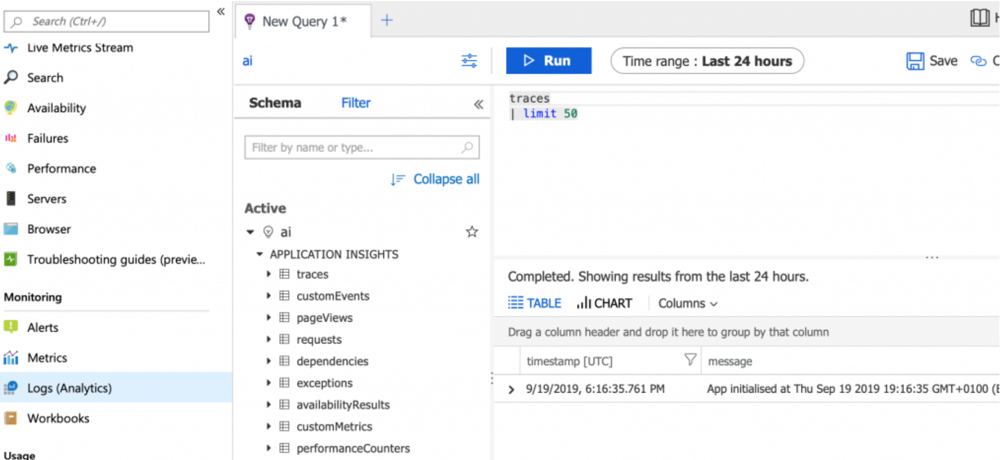

# App Insights #

## Links ##
* [Add App Insights to Angular SPA](https://devblogs.microsoft.com/premier-developer/angular-how-to-add-application-insights-to-an-angular-spa/)
* [Application Insights to JavaScript](https://docs.microsoft.com/en-us/azure/azure-monitor/app/javascript)
* [Add App Insights to Angular ..different take](https://www.c-sharpcorner.com/article/how-to-integrate-azure-application-insights-service-to-an-angular-application/)
* [Add App Insights to Angular yet another way](https://onthecode.co.uk/monitoring-live-angular-apps-with-azure-application-insights/) 
  * Got it working this way

## Notes ##
* 'Workspace Based' requires log analytics workspace
* Buffers user sessions so data not sent back to MS until page is closed
* Can use trace and log analytics

## Angular Single Page App (SPA) Notes ##
* Add instrumentation key to environments constants
* Add the application insights npm dependency
* Create a folder *app\shared* if it does not already exist
* Create `logger.service.ts` and use as a typescript wrapper around teh application insights javascript api
* By default, application insights will not track state based routing changes

* Track and trace (in any place you want to track such at app.componant.ts ngoninit())
* SeverityLevel can be imported or just omit that line
   
        // Log a diagnostic scenario such entering or leaving a function
        this.appInsights.trackTrace({
            message: 'App initialised at ' + new Date().toString(),
            severityLevel: SeverityLevel.Information
        });

* Then query Application Insights Logs with the following

        traces | limit 50

