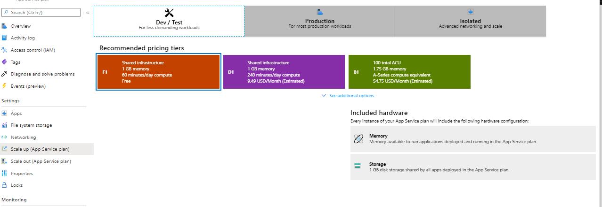
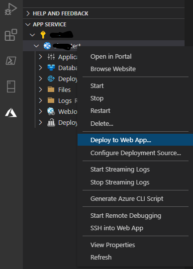

# Azure App Service #

## Setup App Service ##
[Getting Started Doc](https://docs.microsoft.com/en-us/azure/app-service/quickstart-dotnetcore?tabs=netcore31&pivots=development-environment-vs)

**Make Sure your App Service plan is set to the Free Tier**

* Login to Azure and create new App Service
* Set the App Service to Free Tier (May have to turn off 'Always on' if you already pushed your app)

* Open VSCode
* Install the Azure App Service Extension
* Open the Extension and Authenticate with Azure
* Create a new .net Core project
* Push the the Azure App Service
  