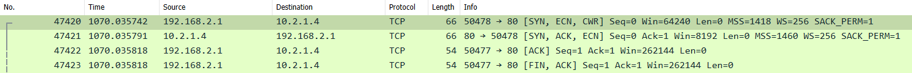

# Azure Internal Load Balancer (ILB) #

## SNAT Behavior ##

Simple Network Address Translation is used on outbound traffic from the load balancer to route traffic to the appropriate backend pool member.

SNAT Port exhaustion is when backend instances run out of available SNAT port resources for that instances pool.

## ILB Hairpin (Internal Load Balancer Can't Call itself) ##

VM calling itself does not recognize both sides of the flow

The Azure ILB does not perform inbound Source-NAT (SNAT) so the original IP is preserved

When using the default LB rule setting, we do perform Destination NAT

**Working Flow** from on prem through ILB to BE Pool Member

**Not Working Flow** from Azure BE Pool member through ILB to BE Pool Member

## Resources ##

* [Azure Load Balancer SNAT for outbound connections](https://docs.microsoft.com/en-us/azure/load-balancer/load-balancer-outbound-connections#exhaustion)
* [Azure LB SNAT Explained](https://msazure.club/azure-load-balancer-snat-behavior-explained/)
* [Azure LB Problems: Accessing Internal LB frontend from particpating LB backend VM](https://docs.microsoft.com/en-us/azure/load-balancer/load-balancer-troubleshoot-backend-traffic#cause-4-accessing-the-internal-load-balancer-frontend-from-the-participating-load-balancer-backend-pool-vm)
* [Azure Internal Load Balancer Hairpin](https://cloudnetsec.blogspot.com/2019/08/azure-internal-load-balancer-ilb-hairpin.html)
* [Azure Application Gateway TLS](https://docs.microsoft.com/en-us/azure/application-gateway/ssl-overview)