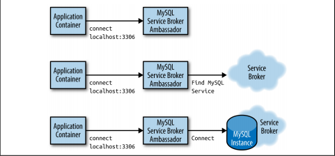
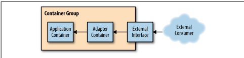
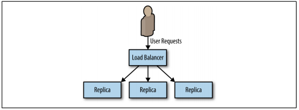
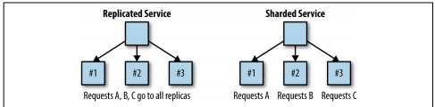
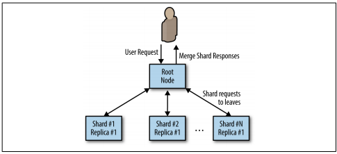
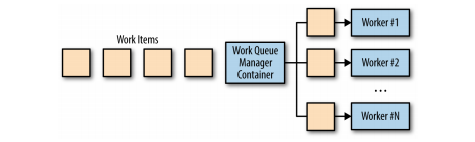
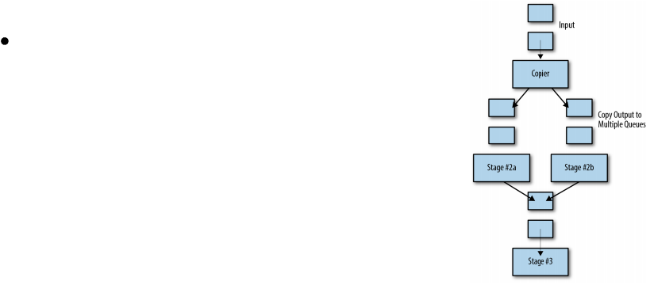
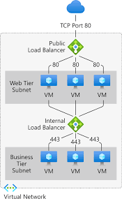

# System Design #

> Remember Everything is a Tradeoff

## **Contents** ##

- Resources
- Interview Question Steps
- Back of the Envelope Calculations
- Scalability for Dummies
- High Level Tradeoffs to Remember
- Non-Abstract Large System Design
- Important Tools to Know

## **Resources** ##

- [ ] [Hacking the Software Engineer Interview](https://tianpan.co/hacking-the-software-engineer-interview/?isAdmin=true)
- [ ] [System Design Primer](https://github.com/donnemartin/system-design-primer#study-guide)
- [x] [Please stop calling databases CP or AP](https://martin.kleppmann.com/2015/05/11/please-stop-calling-databases-cp-or-ap.html)
- [x] [Transactions Across Datacenters](https://snarfed.org/transactions_across_datacenters_io.html)
- [x] [How Google Serves Data From Multiple Datacenters](http://highscalability.com/blog/2009/8/24/how-google-serves-data-from-multiple-datacenters.html)
- [ ] [Google Pro Back of Envelope Calculations](http://highscalability.com/blog/2011/1/26/google-pro-tip-use-back-of-the-envelope-calculations-to-choo.html)
- [ ] [Palantir - How to rock a systems design interview](https://www.palantir.com/2011/10/how-to-rock-a-systems-design-interview/)
- [ ] [Numbers every programmer should know](https://github.com/donnemartin/system-design-primer#latency-numbers-every-programmer-should-know)
- [ ] [Powers of two table](https://github.com/donnemartin/system-design-primer#powers-of-two-table)
- [ ] [What Happens When...](https://github.com/alex/what-happens-when)
- [ ] [SRE Cheat Sheets](https://github.com/michael-kehoe/awesome-sre-cheatsheets/blob/master/README.md)
- [ ] [Distributed Systems Primer by Loyola](https://ds.cs.luc.edu/index.html)
- [ ] [SRE Flash Cards](https://danrl.com/sre-flash-cards/SRE%20Flash%20Cards.pdf)
- [ ] [How to get into SRE](https://blog.alicegoldfuss.com/how-to-get-into-sre/)
- [ ] [My Path to Site Reliablity Management](https://danrl.com/srm/#qualified)
- [ ] [Google Book - Non Abstract Large System Design](https://sre.google/workbook/non-abstract-design/)
- [ ] [Big O Cheat Sheet](https://www.bigocheatsheet.com/)
- [ ] [You're Doing it Wrong (server performance rethought)](https://queue.acm.org/detail.cfm?id=1814327)
- [ ] [Scaling Instagram Infrastructure (video)](https://www.youtube.com/watch?v=hnpzNAPiC0E)
- [ ] [Scalability, availability, stability patterns (slideshare)](http://www.slideshare.net/jboner/scalability-availability-stability-patterns/)
- [ ] [DNS Architecture](https://docs.microsoft.com/en-us/previous-versions/windows/it-pro/windows-server-2008-R2-and-2008/dd197427(v=ws.10)?redirectedfrom=MSDN)
- [ ] [10 Scalable System Design Patterns](http://horicky.blogspot.com/2010/10/scalable-system-design-patterns.html)
- [ ] [No SQL Patterns](http://horicky.blogspot.com/2009/11/nosql-patterns.html)
- [ ] [BigTable Model with Cassandra and HBase](http://horicky.blogspot.com/2010/10/bigtable-model-with-cassandra-and-hbase.html)
- [ ] [NGINX Guide to Designing for Scale](https://www.nginx.com/blog/inside-nginx-how-we-designed-for-performance-scale/)
- [ ] [HAProxy Architecture Guide](http://www.haproxy.org/download/1.2/doc/architecture.txt)
- [ ] [Reverse Proxy vs Load Balancer](https://www.nginx.com/resources/glossary/reverse-proxy-vs-load-balancer/)
- [ ] [Intro to architecting systems for scale](https://lethain.com/introduction-to-architecting-systems-for-scale/)
- [ ] [Crack the system design interview](https://tianpan.co/notes/2016-02-13-crack-the-system-design-interview)
- [ ] [Service Oriented Architecture](https://en.wikipedia.org/wiki/Service-oriented_architecture)
- [ ] [Intro to Zookeeper(Slides)](https://www.slideshare.net/sauravhaloi/introduction-to-apache-zookeeper)
- [ ] [What you should know before building Microservices](https://cloudncode.blog/2016/07/22/msa-getting-started/)
- [ ] [System Design and Architecture Sample Questions](https://github.com/puncsky/system-design-and-architecture)

-----

## **Interview Question Steps** ##

### **1. Outline Use Cases, Constraints and Assumptions [5-mins]** ###

- who are the users?
- how will they use?
- how many users?
- what will the system do
- what are the inputs and outputs
- how much data
- how many requests per second
- read to write ratio
- Usage Patterns

### **2. Estimations [5-mins]** ###

- Throughput (QPS for read and write queries)
- Latency expected from the system (for read and write queries)
- Read / Write Ratio
- Traffic Estimates
  - Write (QPS, Volume of data)
  - Read (QPS, Volume of data)
- Storage Estimates
- Memory estimates
  - if using a cache, what is the kind of data we want to store in cache
  - How much RAM and how many machines do we need
  - Amount of data you want to store in disk / ssd

### **3. Design Goals [5-mins]** ###

- Latency and Throughput requirments
- Consistency vs Availability 
  - Weak / Strong / eventual -> Consistency 
  - Failover / Replication -> Availability

### **4. High level design [5-10 mins]** ###

- APIs for Read / Write scenarios for crucial components
  - Public APIs
  - Private APIs
- Database Schema
- Basic Algorithm
- High level design for Read/Write Scenario

### **5. Deep Dive [15 - 20 mins]** ###

- Scaling the algorithm
- Scaling individual components
  - Availabiity, Consistency and Scale story for each component
  - Consistency and availabilty patterns
  
- **Think about following and how they would fit**
  - DNS
  - CDN [Push Pull]
  - Load Balancers [Active-Passive, Active-Active, Layer 4, Layer 7]
  - Reverse Proxy
  - Application Layer Scaling [Microservices, Service Discovery
  - DB [RDBMS, NoSql]
    - RDBMS
      - Master-Slave, Master-Master, Federation, Sharding, Denormalization, SQL Tuning
    - NoSql
      - Key-Value, Wide-Column, Graph, Document
      - Fast Lookups
        - RAM [Bounded Size] -> Redis, Memcached
        - AP [Unbounded Size] -> Cassandra, RIAK, Voldemort
        - CP [Unbounded Size] -> HBase, MongoDB, Couchbase, DynamoDB
  - Caches
    - Client Caching, CDN caching, Webserver caching, Database caching, Application caching, Cache @ Query level, Cache @Object LLevel
    - Eviction policies
      - Cache aside
      - Write Through
      - Write Behind
      - Refresh ahead
  - Asychronism
    - Message Queues
    - Task Queues
    - Backpressure
  - Communication
    - TCP
    - UDP
    - REST
    - RPC

### **6. Justify [5-minutes]** ###

- Throughput of each layer
- Latency cacuse between each layer
- Overall latency justification

Bonus: Show back of the envelope calculations

-----

## **Back of the Envelope Calculations** ##

**Numbers Everyone Should Know**

- L1 cache reference 0.5 ns
- Branch mispredict 5 ns
- L2 cache reference 7 ns
- Mutex lock/unlock 100 ns
- Main memory reference 100 ns
- Compress 1K bytes with Zippy 10,000 ns
- Send 2K bytes over 1 Gbps network 20,000 ns
- Read 1 MB sequentially from memory 250,000 ns
- Round trip within same datacenter 500,000 ns
- Disk seek 10,000,000 ns
- Read 1 MB sequentially from network 10,000,000 ns
- Read 1 MB sequentially from disk 30,000,000 ns
- Send packet CA->Netherlands->CA 150,000,000 ns 

Keys about the numbers
- Memory is fast and disks are slow
- Even just cheap compression can save a lot of bandwidth
- Writes are 50 times more expensive than reads
- Architect for scaling writes
- Optimize for low contention
- Optimize wide. Make writes as parallel as you can

-----

## **Scalability for Dummies** ##

### 1. Clones ###

#### Overview ####

- Every server contains the same codebase and does not store user related data
- Sessions need to be stored in a centralized data store
  - external database
  - external persistent cache

### 2. Database ###

#### Database ####

- After app grows and starts to get slower you can
  - (not great) Stick with same sql (e.g. MySQL) let is grow and start trying things like master-slave and upgrading RAM and sharding / denomalizing
  - (better) denormalize from the start, no more joins in any database query. Use mysql like NoSQL or switch right away to nosql

### 3. Caches ###

- Caches like Memcached and Redis
- Key value store as a buffering layer between application and storage 
  - App should try to read from here first

#### Cache Patterns ####

1. Cached Database Queries

- Most common used caching pattern
- Hash of query is key, value is returned value
- First check is in cache
- Hard to delete a cached result when you cache a complex query, when one piece of data changes you have to delete all cached queries who may contain cell

2. Cached Objects

- Newer and recommended
- See your data as an object
- Let your class assemble a dataset from your database and store instance of the class in the cache
- Once a data object is assembled, store it directly in the cache (data array or better yet the object)
- Rid the object when something changes
- Worker processes can assemble the object and application never directly touches the database
- Good Objects to cach
  - User Sessions
  - Fully rendered blog articles
  - Activity streams
  - User <-> friend relationships

#### Cache Types ####

- **Redis**
  - allows for persistence and built in data structures
  - with cleverness can use to completely remove a database
- **Memcached**
  - better if just need a cache
  - easy to setup and easy to scale

### 4. Async ###

Asynchronism allows work to be done bit by bit rather than waiting for the whole completed product to be dropped at once

#### Async Paradigms ####

1. Turn dynamic content into static content

- Pages are pre-rendered and stored as static HTML
- Static pages can be stored to CDN to handle scale very well

2. Special requests can not be pre-rendered
   1.  user hits page and a request is sent to a job queue for work. User is shown loading signal. 
   2.  The frontend constantly checks for completed job and pulls content when ready

#### Async Tips ####

- Look at RabbitMQ
- Look at Redis List
- Look at ActiveMQ
- Basic idea is to have a queue of tasks or jobs that a worker can process
- If you do something time-consuming try to do it asynchronously

-----

## **High Level Tradeoffs to Remember** ##

### Performance vs Scalability ###

- **Scalable** = performance increases proportional to resources added
  - Can refer to serving more work or handling larger units of work (e.g. data)

- If you have a performance problem, sthe system is slow for one user
- If you have a scalability problem it is slow under load

### Latency vs Throughput ###

- **Latency** = time to performa an action
- **Throughput** = number of actions per unit of time
- Aim for max througput with acceptable latency

### Availability vs Consistency ###

**CAP Theorem**
You can pick 2 of the 3
- **Consistency** - Every read receives the most recent write or an err
- **Availability** - Every request receives a response, without guarantee it contains most recent information
- **Partition Tolerance** - System continues to operate despite arbitrary partitioning due to network failures

*[You can't chose CA](https://codahale.com/you-cant-sacrifice-partition-tolerance/), Networks are unreliable*

*[Some Systems are not CP or AP](https://martin.kleppmann.com/2015/05/11/please-stop-calling-databases-cp-or-ap.html)*

- **CP** - consistent and partition tolerance
  - waiting for a response might result in timeout. CP is good for atomic reads / writes
  - example: MSSQL(sometimes), MariaDB, MySql(sometimes)
- **AP** - Availability and Partition tolerance
  - Responses return most readily available version. Eventually consistent.
  - example Cassandra

-----

## **Consistency Patterns** ##

### Weak Consistency ##

*After a write, reads may or may not see it*

- uses
  - VoIP
  - Realtime Multiplayer

### Eventual Consistency ###

*After a write, reads will eventually see it. Asynchronous Replication*

- Uses
  - DNS, Email, Highly Available Systems

### Strong Consistency ###

*After a write, reads will see it. Data replicated synchronously. Across datacenters, multi-write is a better option but costs in latency*

- Uses
  - RDBMSes
  - Transactional DBs

-----

## **Availability Patterns** ##

Fail-over and Replication are complimentary 

### Failover ###

- **Active Passive**
  - one primary and one in hot standby (SQL AG)
  - Changes are typically replicated as part of the replication log / change stream
  - when the heartbeat goes away the standby takes over
  - length of downtime determined by failover time
  - You can see data loss depending on the replication pattern
- **Active-Active**
  - both servers managing traffic with load balancera
  - Could potentially lead to inconsistent state
  - Also referred to as multi-master

### Replication ###

- **Single-Leader**
  - Single writable reader with follower(s)
  - Asynchronous = leader does not wait for followers to catch up before considering actions a success
    - More risk of data loss if leader crashes
    - Crashing / latent follower won't block writes
  - Synchronous = action must be successful on follower before leader considers change successful
    - Less risk of data loss if leader crashes
    - A lagging or unresponsive follower can block writes
  - You can have multiple followers some synchronous and others async
- **Multi-Leader**
  - more than one node can accept writes
  - Does not make sense for single data center
  - Does make sense with multi-data center
  - Pros
    - better write performance for users closer to far data center
    - Tolerant of data center outages
    - tolerant of network problems
  - Uses
    - Clients with offline communication (every device has local db)
    - Collaborative editing (google docs)
  - Biggest con, have to handle for write confllicts
    - conflict avoidance (e.g. user assigned a datacenter)
    - Convergence (e.g. last write wins)
    - Resolve on read or resolve on write
- **Leaderless**
  - All Nodes are Writeable
    - Cassandra
    - Voldemort
  - Writes sent to multiple nodes
  - Reads are sent to multiple nodes
    - used to detect and correct nodes with stale data
  - Multi-Datacenter
    - Writes sent to all nodes but client only waits for concensus from local datacenter
  
-----

## **Non-Abstract Large System Design** ##

-----

## **Distributed System Patterns** ##

[Derived from Azure Designing Distributed Systems](https://azure.microsoft.com/mediahandler/files/resourcefiles/designing-distributed-systems/Designing_Distributed_Systems.pdf)

### Microservices ###

- Multi-Node Distribued architectures Contrasted to Monolithic Systems
- Typically communicating over a defined API
- Benefits
  - Reliability
  - Agility (quick and frequent deployments)
  - Reduced team size
  - Reliable API contracts remove need for tight synchronization
  - Better Scaling
- Downsides
  - Loosely coupled system can be difficult to debug
  - Difficult to design and architect
- Benefit from using well known patterns
  
### Single Node Patterns ###

- **SideCar Pattern**
  - Sits on the side of an existing application
  - Extends functionality, sometimes transparently to the application
  - Creeping legacy app or extension app (e.g. add https)

- **Ambassador Pattern**
  - Helps to adapt existing application to sharded backend
  - The application code only knows it needs to talk to storage which it finds (ambassador) the ambassador then performs the necessary sharding
  - *Service Brokering* is the act of having the ambassador introspect the environment and find appropriate service to connect 
  - *Experimentation / Request Splitting* can be handled by the ambassador (e.g. a/b testing)

  
  
- **Adapters**
  - adapter is used to modify the interface of the application container so it conforms to a predefined interface expected of all applications
  - Can ensure application implements a consistent monitoring interface
  - To effectively monitor and operate you need common interfaces
  - Applows deployment of a single tool that uses this interface
  - Useful for monitoring applications

### Multi-Node Patterns ###

- **Replicated Load Balanced Services**
  - **Stateless ** load balanced systems
    - static content
    - middlewhare systems that aggregate responses
  - **Session Tracked** load balanced system
    - typically done via consistent hashing function (to account for node scaling)
    - Deploy Cache using **Sidecar Pattern** is option but uses a lot of memory
  - provide redundancy and scale
  - Need at least 3 nodes (2 replicas) for 'Highly Available'
  - Ability to **horizontally scale**
  - Should have some type of health / Readiness probe

- **Sharded Services**
  - Different requests go to different services
  - Commonly used for sharding cache serving but useful for any service where more data needed than can fit on sigle machine

- **Scatter Gather Pattern**
  - parallelism by servicing requests to different nodes then pulling the values back together
  - **With Root Distribution**
    - User request to root App node
    - Shards request to leaves
    - Requests pulled back by root node and served back to user
    - (e.g. Document search with **Elastic Search**)

-----

## Batch Computational Patterns ##

- **Work Queue Systems**
  - simplest batch processing
  - perform each piece of work processed within a certain period of time
  - Worker nodes and queue manager node
  - Can allow for **dynamic scaling** of workers

- **Event Driven**
  - Chains the output of one queue to the input of the next queue
  - Need an overall blueprint for how different event queues relate to each other
  - **Copier**
    - Take single stream of work and dupllicate it
    - multiple pieces of work to be done on same item
  - **Filter**
    - reduce stream to a smaller stream of work
    - filter out items that don't meet criteria
  - **Splitter**
    - sends different inputs to different queues
  - **Sharder**
    - divide a single queue into an evenly divided collection of work
  - **Merger**
    - turn multiple work queues and turn them into a single work queue

-----

## DNS (Domain Name System) ##

### DNS Overview ###

- DNS is how a device determines an IP address from a URL (i.e. website.com -> 22.12.2.12 )
- Hierarchical, if the DNS server you query does not know, it will ask up a level
- Lower level servers will cache requests which can become stale. Staleness is determined by TTL (Time to Live)

### Common DNS Record Types ###

- A Record (address) - Most common, points a FQDN (Fully Qualified Domain Name) to IP address
- CNAME Records (canonical) - Points a name to another name (Like an alias)
- NS Record (Name Server) - Specifies the DNS server for your domain
- MX Record (Mail Exchange) - Specifies mail servers for accepting messages

### DNS Services ###

- **Weighted Round Robin**
  - send traffic to different servers
- **Latency-based**
- **Geolocation-based**

### DNS Costs ###

- Accessing DNS introduces a delay, which is why results are cached
- DNS server managment is comples
- DNS services can come under attack

-----

## CDN (Content Delivery Network) ##

### CDN Overview ###

- Globally distributed network of proxy servers serving content from close to the user 
- Generally static such as html, photos, videos, etc.
- Site DNS typically gets user to a CDN
- Users Receive data faster and less strain on App Servers

### Push CDNs ###

- Receive new content whenever changes occur
- You must expire content
- Works best for sites that do not change often or have small sets of data
- Uses a lot of data on the CDN

### Pull CDN ###

- Leave your content on the server until the first user requests the content
- You leave content on your server and rewrite URLs to point to the CDN
- Request is slower until content is cached on CDN
- TTL tells CDN when to pull again
- Pull CDNs minimize storage but can create redundancy
- Heavy traffic load sites work better with pull CDNs

### CDN Disadvantages ###

- CDN costs can be significant
- Content may become stale based on TTL
- CDNs require changing URLs for static content before Pointing to CDN

-----

## Load Balancers ##

### Load Balancers Overview ###

- Load balancers distribute incoming client requests to computing resources (e.g. applications and databases)
- Standard use case for **Horizontal scaling**
- Returns the response from the computing resource to the appropriate client
- Can be implemented with hardware, software, or cloud service
- Typically configured as multiple, either in **active-passive** or **active-active**

### Load Balancer Effectiveness ###

- General Benefits
  - Prevent requests from going to unhealthy servers
  - Preventing overloading a single server (depending on balancing type)
  - Help reduce single points of failure
- Type dependant benefits
  - **SSL termination** - Decrypt incoming requests and encrypt responses so the operation does not have to be performed by backend servers (expensive action) and reduces the locations that SSL certificates need to be installed
  - **Session Persistence** - Issue cookies and route a specific client request to the same instance

### Load Balancer Algorithms ###

- Random
- Least Loaded
- Session/cookies
- Round Robin
- Weighted Round Robin

### Layer 4 Load Balancer ###

- Only look at the **transport layer** to distribute packets (source / destination IP, and port information)
- Forward packets to and from upstream server performing Network Address Translation (NAT)

### Layer 7 Load Balancer ###

- Look at application layer to distribute traffic
- Can examine header, message, cookies, etc
- Terminate network traffic -> read message -> makes a LB decision -> opens a connection to the selected server
- Could direct video traffic to video servers or billing traffic to billing servers
- Can perform path sensitive redirection

### Load Balancer Trade-Offs ###

- Scaling horizontally introduces complexity
  - servers should be stateless: no user specific data
  - Sessions will need to be stored in a centralized data store (SQL, NoSQL) or persistent cache (Redis, memcached)
  - Downstream servers (e.g. caches and databases) will need to handle more connections as upstream servers scale out
- LB can become a bottleneck or single point of failure
- Increased complexity

-----

## Reverse Proxy ##

- Web Server that centralizes internal services
- Unified interfaces to public
- Requests from clients are forwarded to a server that can fulfil the request first

### Reverse Proxy Benefits ###

- Increased Security
  - hide info about backend servers
  - blacklist IPs
  - Rate limiting
- Increased Scale / Flexibility
  - Clients only see reverse proxy IP
  - Scale servers or change configuration
- SSL Termination
  - Decrypt incoming requests and encrypt server responses to backend
  - Don't have to installl certs on every server
- Compression
  - Compress server responses
- Caching
  - Return the response for cached requests
- Static Content
  - Serve static content directly
    - HTML / CSS / JS
    - Photos
    - Videos
    - etc.

### Reverse Proxy Disadvantages ###

- Reduced complexity
- Single point of failure or even more complexity with failover reverse proxies

### Reverse Proxy Vs Load Balancer ###

- Load balancer is only useful with multiple servers
- Reverse proxies can be useful even with just one back end server
- NGINX and HAProxy can support layer 7 reverse proxying and load balancing
  
### Reverse Proxy Examples ###

- Nginx

-----

## Application Layer ##

- Common in N-Tier Architecture (Web - App - DB)
- Single Responsibility principle advocates for small and autonomous services
- Help enable asynchronism

### Microservices in App Tier ###

- suite of independently deployable, small, modular services
- communicate through a well-defined, lightweight, mechanism

### Service Discovery ###

- Systems such as **Consul**, **Etcd**, and **Zookeeper** help services find each other
- Health checks help verify service integrity
- Key-Value store can be useful for storing config values and other shared data

### Disadvantages ###

- Adding an app tier with loosely coupled services requires a different approach
  - architectural considerations
  - Operations considerations
  - Process considerations
