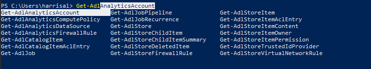

# Generally Useful Commands #

## Quick PowerShell Hop Into Another Computer ##

```powershell
    Enter-PsSession ServerName01
    #Alias
    etsn ServerName01
    [<servername01>]: exit
```

## Command Session History ##

### See all history for current session ###

`get-history`

### Search for term in History ###

start typing then press `F8` to search for typed text

### Search backwards through History ###

`ctrl+r` then start typing

### Invoke specific command from history ###

find desired command with `get-history`
`Invoke-History <# of command>`

## See all available keybindings ##

`ctrl+shift+alt+?`

## Tab Completion ##

- Tab Completion with Wild Cards*
  - `*keyword*`  + TAB
- *Tab Completion with Menu*
  - `get-adl` + ctrl+space



## See Results Before Assigning to Variable ##

```powershell
Get-ChildItem | Tee-Object -Variable var
...output...
$var
...output again...
Get-ChildItem | Tee-Object -FilePath C:\temp\output.txt
```

## Trace-Command to debug ##

```powershell
Trace-Command * -Expression  {<thing to run i.e. script or cmdlet>} -PSHost
```

## Pivot to Drive With Alternate Creds ##

``` powershelll
net use \\server\share /user:<domain\username> <password>
copy \\server\share\file.txt c:\temp\file.txt
```

## Remote COAF Fix ##

``` powershell
Get-Item -Path HKLM:\system\CurrentControlSet\Control\Lsa\ 
Set-ItemProperty -Path HKLM:\system\CurrentControlSet\Control\Lsa\ -Name 'crashonauditfail' -Value 1
```

## Open explorer in current path ##

```powershelll
invoke-item .
ii.
```

## Enumerate Dictionary / Hash Table ##

```powershell
$hash = @{
    'key' = 'value'
}

foreach ($key in $hash.getEnumerator()) {
    Write-Host "$($key.name) = $($key.value)"
}
```

## See Current Session Variables ##

```powershell
Get-Variable 
Get-Variable | Out-String
```

## Manage Certificates ##

### Complete CSR Request ###

```powershell
Get-ChildItem Cert:\LocalMachine\My
Import-Certificate -filepath "....\certname.cer" -CertStoreLocation Cert:\LocalMachine\My
```

### Export and Import Pub/Priv Key Pair ###

```powershell
$cert = Get-ChildItem Cert:\LocalMachine\My | Where {$_.FriendlyName -match 'friendlyname'}
Export-PfxCertificate -cert $cert -FilePath c:\temp\cert.pfx -Password (Read-Host "enter pw" -AsSecureString)
Copy c:\temp\cert.pfx \\remotesrv\c$\temp\cert.pfx
etsn remotesrv
Import-PfxCertificate -FilePath c:\temp\cert.pfx -CertStoreLocation Cert:\LocalMachine\My -Password (Read-Host "enter pw" -AsSecureString)
```

## General Admin ##

### DNS ###

see how long a dns name has before ttl expires

```powershell
Resolve-Dns <name>
```

## Tail a File ##

*Get the tail of a file*

```powershell
Get-Content -tail 100
# continues to wait for new input
Get-Content -tail 100 -wait 
```

## Remote Session Stuff ##

```powershell
$session = new-pssession <computer>
copy-item <source> <dest_on_remote> -tosession $session
invoke-command $session {command}
icm $session {command}
```

## Get available Aliases ##

`get-alias`

## Verify script is run as admin ##

```powershell
# Requires-RunAsAdministrator
```

## Record Everything ##

`start-transcript`

## Param Stuff ##

- *Inherit all the -debug, -verbose, param goodness*
  - `[CmdletBinding()]`
- *Make a param Mandatory*
  - `[Parameter(Mandatory=$true)]`
- *Param must match a defined set of values*
  - `[ValidateSet('value','value2')]`
- *Make sure param not null*
  - `[ValidateNotNullOrEmpty()]`
- *Create Parameter Sets*
  - Use a 'DefaultParameterSetName' that doesn't exist to allow an empty set

```powershell
[CmdletBinding(DefaultParameterSetName="ScriptBlock")]
param (
    # Script block to test the performance of
    [Parameter(Mandatory=$true,ParameterSetName="ScriptBlock")]
    [ScriptBlock]
    $Command,

    [Parameter(ParameterSetName="ScriptBlock")]
    [ValidateRange(1,10000)]
    [Int32]
    $Iterations = 100
) 

swtich ($PsCmdlet.ParameterSetName) {
        "ScriptBlock" {
            # Do This Stuff
        }
}
```

- *Allow Param to be passed in the pipeline*
  - `[Parameter(ValueFromPipeline=$true)]`
- *Add Alias for additional support*

```powershell
[Parameter(Mandatory=$true,ParameterSetName='ComputerSpecified',ValueFromPipeline=$True)]
[Alias("Computer")]
[String[]]$ComputerName
```

- Use Splatting for passing param sets

```powershell
$cimParams = @{
    ClassName = Win32_Volume
    ComputerName = $Computer
}

Get-CimInstance @cimParams
```

## Lets make an object ##

**Note Do NOT USE New-Object, considered depreciated**

*Make a dictionary of properties and values and use to create a powershell object*

```powershell
$obj.color
> blue

# Same Same but different
$myobj = [pscustomobject]@{
    location = 'USA'
    color = 'blue'
}
```

*You can also set a custom object type, helpful when validating in custom modules by passing around*

```powershell
$obj.color
> blue

# Same Same but different
$myobj = [pscustomobject]@{
    TypeName = 'My.Object'
    location = 'USA'
    color = 'blue'
}
```

*If you need to add additional properties you can*

## See all Object Properties ##

- See all properties on an object

- `\<theobject\>.psobject.Properties`
  
## Save an Object for later then get it back

*Save an object into json, then get it back*

```powershell
# make the object
$myobj = [pscustomobject]@{
    location = 'usa'
    color = 'blue'
    favorites = @{
        food = 'pizza'
        drink = 'tea'
    }
}

# Drop into a json file
$myobj | convertto-json -depth 5 | out-file 'obj.json'

# Get it back, -raw is critical
$newObj = get-content 'obj.json' -raw | convertfrom-json 

$newObj.favorites.food
> pizza
```

## Object Properties and Converting to Hashtable ##

*Look at detailed object properties*

`$myObject.psobject.psobject.properties`

*convert to hashtable*

```powershell
# Create a PSCustomObject (ironically using a hashtable)
$ht1 = @{ A = 'a'; B = 'b'; DateTime = Get-Date }
$theObject = new-object psobject -Property $ht1

# Convert the PSCustomObject back to a hashtable
$ht2 = @{}
$theObject.psobject.properties | Foreach { $ht2[$_.Name] = $_.Value }
```

## Get Drives ##

- use `Get-PSDrive` to get all drives and virtual drives

- use `Get-PSDrive -PSProvider 'FileSystem' to only get file drives`

## Measure command time ##

- When you know multiple implementations of something, check the performance using `Measure-Command`

```powershell
Measure-Command { Get-PSDrive -PSProvider 'FileSystem'}
#output here
Measure-Command { Get-Drive }
# output here
```

## Get CIM Values ##

- You have to get into the CIM Properties and specifically extract the name and value

```powershell  
$vols = Get-CimInstance -ClassName Win32_Volume
$vols[0].CimInstanceProperties | Select-Object Name,Value
```

# Passing Creds / Multiple computers

$comps = @('comp1.contoso.com','comp2.contoso.com')
$cred = get-credential
$cimSessions = New-CimSession -Credential $cred -ComputerName $comps
$volumes = Get-CimInstance -CimSession $cimSessions -ClassName Win32_Volume

- Get specifics on all CIM Properties at [PowerShell one](https://powershell.one/wmi/root/cimv2)
- You can also add filter queries on using WSQL, helps to reduce data returned for post-processing

```powershell
# Query by process name without specifying class outside query
Get-CimInstance -Query "SELECT * from Win32_Process WHERE name LIKE 'P%'"

# Query to filter out optical drives while specifying classname
Get-CimInstance -ClassName Win32_Volume -Filter "DriveType != 5"
```

## Debugging ##

- From VSCode Launch the Debugger targeting the terminal

## Switch Statments ##

- Use for control flow of multiple conditions

```powershell
switch ($value) {
    1 { write-host "value is 1"}
    2 { write-host "value is 2"}
    Default { write-host "value is not 1 or 2"}
}
```

- Can compare for multiple values

```powershell
switch ($value) {
    {1,"one" -contains $_} {write-host "value is one"}
    {2,"two" -contains $_} {write-host "value is two"}
    Default {write-host "value is not one or two"}
}
```

## HTML Oddness ##

- Chrome Requires that HTML and CSS matches the file encodings exactly

- When outputting HTML default to UTF8 using the following
- Otherwise you will bang your head on the wall with CSS not applying correctly

```powershell
$HtmltoOutput | Out-File "page.html" -encoding utf8
```

## Pop location ##

- Quickly set and go back to a location

```powershell
PS c:\temp> push-location
PS c:\temp> cd ..
PS c:\> pop-location
PS c:\temp> 
```

## Serialize a PowerShell Object to XML for Later Use ##

[Export-CliXml](https://docs.microsoft.com/en-us/powershell/module/microsoft.powershell.utility/export-clixml?view=powershell-5.1)

```powershell
# Serialize the result of 'Get-Adapter' to xml
Get-Adapter | Export-Clixml -Path 'C:\tmp\adatperxml.xml'
...
# inside the test copy the contents from the xml as a string
$getAdapterMockObject = @"
<Objs Version="1.1.0.1" xmlns="http://schemas.microsoft.com/powershell/2004/04">
    <Obj RefId="0">
    <TN RefId="0">
        <T>Microsoft.Management.Infrastructure.CimInstance#ROOT/StandardCimv2/MSFT_NetAdapter</T>
        ... #etc etc
        <S N="ifDesc">Hyper-V Virtual Ethernet Adapter</S>
        <S N="ifName">ethernet_32771</S>
        <S N="DriverVersion">10.0.14393.0</S>
        <S N="LinkLayerAddress">00-15-5D-02-0F-00</S>
    </MS>
    </Obj>
</Objs>
"@

# Deserialize it back into an object
$myobj = [System.Management.Automation.PSSerializer]::Deserialize($getAdapterMockObject)

# Mock the cmdlet with the object
Mock Get-NetAdapter { return $myobj }
```

## Register Scheduled Task ##

- Create a scheduled task then export the XML
- Copy over the xml to another computer (d:\temp\task.xml)
- import the task on the other computer

```powershell
enter-pssession computer2
[computer2]: PS c:\user> Register-ScheduledTask -Xml (get-content d:\temp\task.xml -Raw) -TaskName 'Task 1' -User 'NT Authority\System'
```

## Setting and Getting Variables ##

### Basics ###

- $ is the PowerShell indicator for 'what follows is variable"
- $temp is the variable named temp

### Multi-Setting ###

- `$tempOne = $tempTwo = "Hello"`
- both $tempOne and $tempTwo directly equal "Hello", $tempOne is not a reference to the other variable

### Hash Variables ###

- `$hashOne = @{}`
- `$hashTwo = $hashOne`
- the variable $hashTwo is NOT a copy of $hashOne, both reference the same object
- use $hashOne.Copy() to copy the hash

### Getters / Setters ###

- You can get and set variables with cmdlets rather than using the $ ref, this can be handy

```powershell
$temp = "Hello"
write-host $temp

> "Hello"

$ref = Get-Variable -Name temp
$ref

> Name  Value
    ---   -----
    temp  hello

Set-Variable -Name temp -Value "goodbye"
$ref

> Name  Value
    ---   ------
    temp  goodbye
```

## Funkiness ##

### .where vs Where-Object ###

- Where-Object can be up to 10x slower than .where since it evaluates cmdlet binding

## Get Functions ##

### Function Virtual Drive ###

- Functions are stored in a virtual drive
  - `Get-ChildItem -Path function:\ # See alll`
  - `Get-ChildItem -Path function:\Format-Hex | select -property * # see specific`
  - `(Get-ChildItem -Path function:\Format-Hex).Definition # See code`

### Get-Command ###

- Get-Command returns information about available commands
  - `Get-Command Format-Hex -syntax` will return valid param sets
  - `Get-Command Format-Hex -ShowCommandInfo` will return all information about the command (definition, name, module, etc.)

- Get-Member retuns information about a variable
  - `Get-Member -InputObject $var` returns information

## Path Object From Get-ChildItem ##

```powershell
[CmdletBinding()]
Param (
    [Parameter(Mandatory = $true, ValueFromPipeline = $true, ValueFromPipelineByPropertyName = $true)]
    [Alias('FullName')]
    [string]
    $InputObject
)
```

## Start new PowerShell as Admin from existing non-admin PowerShell

` > Start-Process Powershell -verb runas `

## If you Invoke Powershell with CMD you may have trouble with Validating Parameter Sets ##

[Why Won't PowerShell Recognize Quoted Parameters](https://stackoverflow.com/questions/55201798/why-does-powershell-not-recognize-quoted-parameters)

TLDR: Instead of "powershell "%cmdir%..\script.ps1" use "powershell -file %cmdir%..\script.ps1"

## Get all logged in Users and Status ##

returns all sessions and states

```powershell
> qwinsta
SESSION NAME  USERNAME  ID  STATE TYPE  DEVICE
.....
```

## Redirect PowerShell Output to the Clipboard ##

Add output to the clipboard with `clip`, useful to avoid having to copy from the shell

```PowerShell
ps> Get-Service | clip
```

